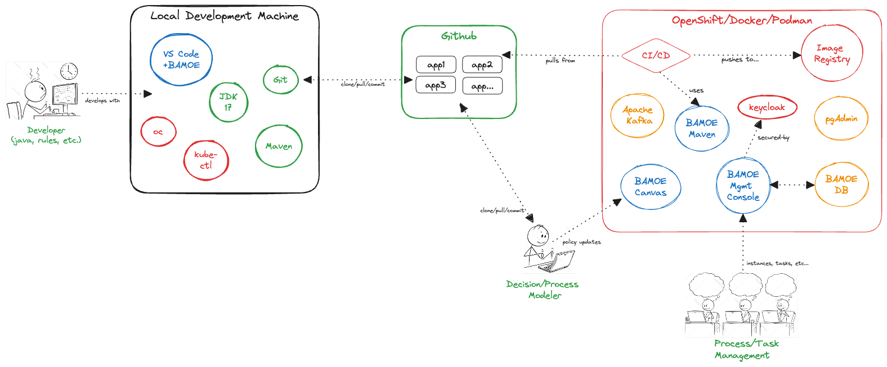

# IBM Business Automation Manager Open Editions - Setup Instructions
This repository contains all the necessary scripts, configuration files, and other resources necessary to setup BAMOE v9.1.1-GA.

## Overview
This repository creates the necessary infrastructure services for a typical BAMOE implementation, as represented by the following diagram:

## Requirements for Local Machine Setup
The following instructions are helpful in setting up your local environment in order to do BAMOE development.  All functions of BAMOE are available from the developer workstation, including web-based tools and consoles.

- **JDK 17** (https://developer.ibm.com/languages/java/semeru-runtimes/downloads/), prefer the IBM Semeru release of JDK, but any OpenJDK will do
- **GIT Command Line Interface** (https://git-scm.com/downloads), plus you are free to install any GIT related extensions or simply use the command line tools
- **Maven Command Line Interface** (https://maven.apache.org/install.html), used for builds and deployments of BAMOE libraries, plus you are free to install any Maven related extensions or simply use command line tools.
- **VS Code IDE** (https://code.visualstudio.com/download), and install the following extensions from the VS Code Marketplace:
`BAMOE Developer Tools`, this is the set of editors for DMN, BPMN, and PMML that developers use to create their visual models in the IDE Drools (by Jim Moody), this is a third-party editor which does simple syntax highlighting of the Drools Rule Language (DRL) files.

## Running Container Images Locally
There are several pre-built container images which assist the developer.  These images require a container management system, such as **Docker**, **PodMan**, or **Rancher Desktop**.  Most BAMOE technologists use **Rancher Desktop**, which can be run in `docker` mode, and we can supply a startup repository that installs Canvas and other images into your Rancher installation.  If you plan to install the container images on your laptop, we will also guide you through this, but here are the instructions if you want to get ahead.  

## Setting up BAMOE - Environments
- [Docker Compose](./environments/docker-compose/README.md)
- [Red Hat OpenShift](./environments/openshift/README.md)
- [Vanilla Kubernetes (minikube)](./environments/kubernetes/README.md)
- [Podman](./environments/podman/README.md)
